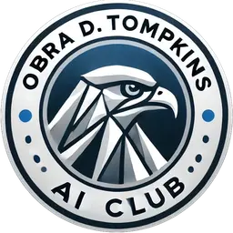

# Obra D. Tompkins Artificial Inteligence and Machine Learning Club



> oths ai club for short

Welcome fellow Ai enthusiasts, this is the github where we post our example codes for ai models

below is the list to the units containing the code

## Units

[Unit 1](https://github.com/othsml/unit1)

## Slides

All of our slides are posted to the remind or on the discord. we also have a mirror on the slides repository [here](https://github.com/othsml/slides)

## Help

if you need any help running or setting an ai development environmment up, we have a repository with docs to help you get started with ai

[docs](https://github.com/othsml/unit1)

## Join Ai club

if you want to join ai club you can join the [remind](https://remind.com) and enter code ```@othsml```
